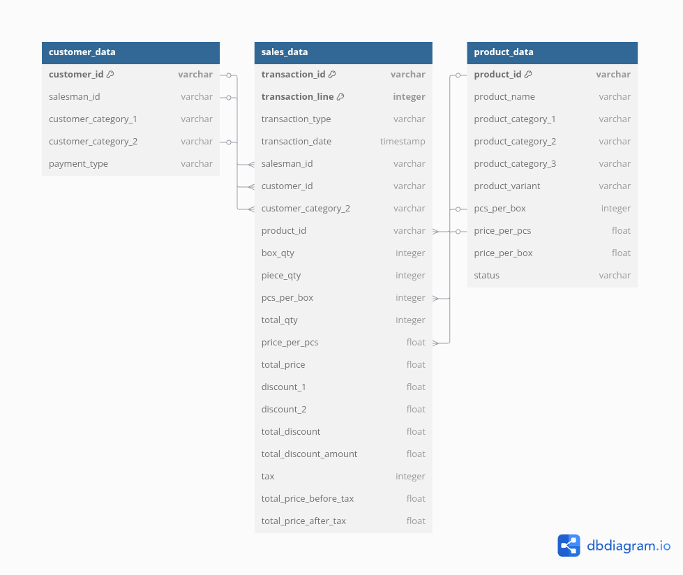

# *Pratama Nusantara Dairy* - Sales Performance Analysis (Nov 2024 - Feb 2025)

## Project Background
### Company Info
**Pratama Nusantara Dairy (PND)** is an Indonesian dairy company with two main plants in Bekasi and Bandung. PND offers 90 SKUs and distributes through 70+ partners across Indonesia. This project focuses on analysis of sales data from November 2024 to February 2025 for one of the city in Sumatra. Recommendations will be provided to improve sales performance, mainly for Area Business Manager.

### Objectives
- **Analyze key sales metrics** *(total sales, returns, transactions, unique customers, & more)* to identify overall performance trends and fluctuation from November 2024 to February 2025.
- **Evaluate the performance of Salesman, Product, and Customer segments** to identify key points of sales success and also area of improvements.
- **Provide actionable recommendations** based on the findings and analysis to support Area Business Manager in optimizing strategies and improving overall sales performance.

### Deliverables
- Sales Performance Analysis Report (PDF)
- Sales Performance Dashboard (Tableau) *(On Progress)*
- Detailed Exploratory Data Analysis (Excel/Python Notebook) *(On Progress)*

## Executive Summary

## Technical Details

### Dataset

#### `sales_data`

The **`sales_data`** table tracks every transaction. It includes unique IDs for the **transaction**, **line item**, the **date** of sale, and quantities sold in both **boxes** and **pieces**. It also contains detail about **price per piece**, **total price** before and after discounts and taxes, and the **discount amount**. Each sale is linked to a **salesman**, **customer**, and **product**.

#### `customer_data`

The **`customer_data`** table stores information about each customer. It has a unique **customer ID** and notes their linked **salesman ID**. Customers are categorized into **primary** and **secondary groups** for segmentation. It also records their usual **payment type**.

#### `product_data`

The **`product_data`** table lists all products. Each product has a unique **ID**, its **name**, and up to **three categories** for classification. It also specifies **product variants**, **pieces per box**, and prices for both **individual pieces** and **full boxes**. The **status** indicates if the product is available.

### Entity Relationship Diagram

### **Acknowledgements**

Pratama Nusantara Dairy is a fictional company. This dataset inspired from real-world sales data and has undergone modification to remove obvious similarities.

## Detailed Insight

### Overall Performance

  

#### Total Sales, Returns, Transactions, and Customers over Month

  

- Sales peaked in December 2024 at `Rp5.01 B` before dropping to `Rp3.57 B` in February 2025. The highest month-over-month increase was `+5.5%` in December, while the largest decrease was `-26.9%` in February. This significant drop likely reflects a "Post-Festive Slump," as sales often decline after the holiday season that spans from December to January.

  

- Return values show a concerning upward trend that requires further investigation. To understand the root cause, a deeper analysis into the types of returns is needed. An increase in returns suggests potential demand or quality issues that may have originated 3-6 months prior to the return date.

  

- The number of transactions has steadily decreased over the period, even during the festive season. The most significant drop occurred in February 2025, aligning with the overall decline in sales.

#### Average Sales and Unique Products per Transactions over Month

  

- The average sales value per transaction saw its largest increase in **December 2024** at `+12.8%`. It then experienced consecutive decreases in January 2025 and February 2025, with the steepest decline of `-19.7%` occurring in February.

  

### Salesman Performance

#### Salesman Customer Segmentation

| salesman_id | customer_category_served                                                                                                           |
|-------------|------------------------------------------------------------------------------------------------------------------------------------|
| `SM03353`     | Minimarket, Supermarket                                                                                                            |
| `SM03376`     | Minimarket, Supermarket                                                                                                            |
| `SM03378`     | Second Dealer                                                                                                                      |
| `SM03385`     | Second Dealer                                                                                                                      |
| `SM03344`     | Bakery, Beverage Stall, Cafe, Canteen, Company, Food Supplier, Hotel & Leisure, Restaurant                                         |
| `SM03322`     | Healthcare Institution, Internal Selling, Market Retail, Minimarket, Residential Retail, Second Dealer                             |
| `SM03361`     | Minimarket, Residential Retail, Second Dealer                                                                                      |
| `SM03338`     | Market Retail, Minimarket, Residential Retail, Second Dealer                                                                       |
| `SM03332`     | Baby Store, Market Retail, Minimarket, Residential Retail, Second Dealer                                                           |
| `SM03367`     | Healthcare Institution, Market Retail, Minimarket, Residential Retail, Second Dealer                                               |
| `SM03317`     | Baby Store, Market Retail, Minimarket, Residential Retail, Second Dealer, Supermarket                                              |
| `SM03331`     | Baby Store, Beverage Stall, Healthcare Institution, Internal Selling, Market Retail, Minimarket, Residential Retail, Second Dealer |
| `SM03388`     | Internal Selling                                                                                                                   |

#### Overall Sales Performance by Salesman

- There are 6 salesmen who achieved sales above `RP1.0 M` and 3 salesmen who achieved sales above `Rp2.0 M`.

- The highest sales were achieved by salesman SM03353 with a value of `Rp3,403,193,635` and the lowest sales were achieved by SM03388 with a value of `Rp7,668,108`.

- A total of `267` transactions with a sales value of `Rp72,488,314` were not assigned to any salesman. If this is due to a system error, it must be resolved as soon as possible.

- The highest average sales value was achieved by SM03353 at `Rp8,550,738`, followed by SM03376 with an average of `Rp8,155,428`.

#### Sales over Month by Salesman

- There are two distinct sales trend patterns observed among the salesmen:
  - **December Peak**: Five salesmen experienced their highest sales in December 2024.
  - **January Peak**: Seven salesmen experienced their highest sales in January 2025.
- These two patterns are also reflected in the sales performance when analyzed by product category.

#### Total Sales by Salesman & Product Category

#### Total Sales by Salesman & Customer Category

### Customer Performance

#### Overall Sales Performance by Customer Category

#### Sales over Month by Customer Category

#### Total Sales by Product Category & Customer Category

#### Top 3 Customer by Sales per Customer Category

#### 3 Customers with Highest Returns per Customer Category

### Product Performance

#### Overall Sales Performance by Product Category

#### Sales over Month by Product Category

#### Top 10 Product by Sales

#### Bottom 10 Product by Sales

#### Top 10 Products with Highest Returns

#### Top 10 Products with Highest Return to Sales Ratio

## Recommendations

